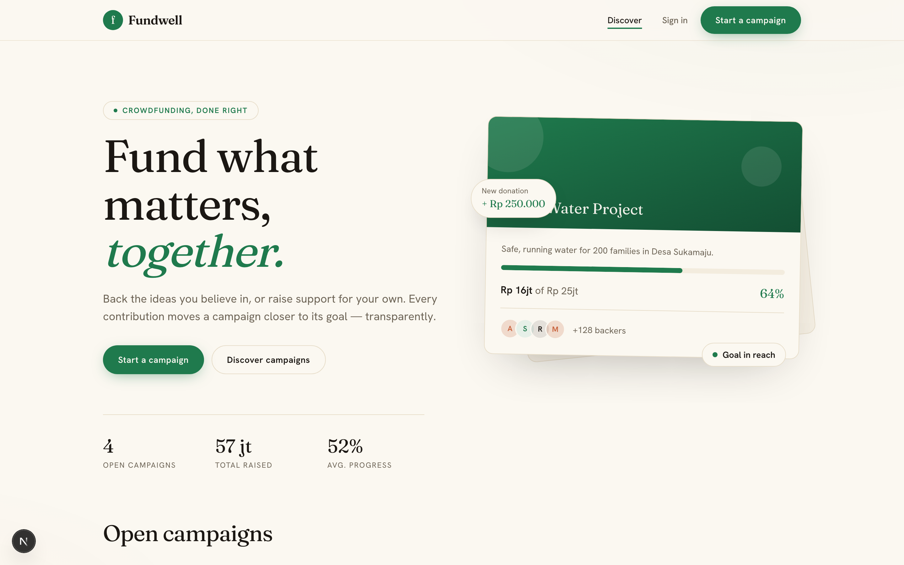
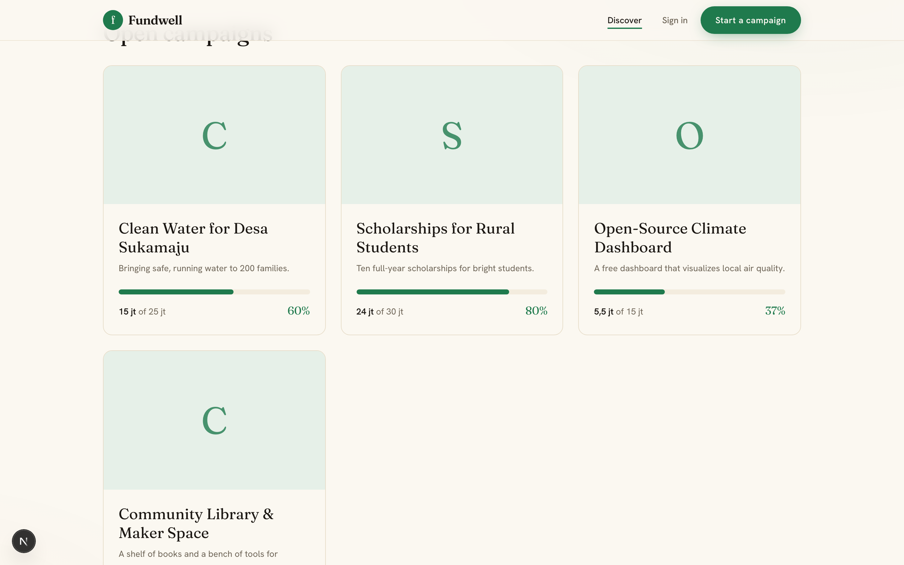

# Fundwell — Crowdfunding Web

A web client for the [crowdfunding REST API](https://github.com/wikukarno/crowdfunding),
built with Next.js (App Router), TypeScript, and Tailwind. People can browse
campaigns, start their own, and donate through a payment gateway.

The app follows a backend-for-frontend approach: the browser talks only to the
Next.js server, which holds the session and forwards requests to the Go API. The
API token is never exposed to client-side JavaScript.





## Features

- **Discover** — browse open campaigns with live funding progress
- **Campaign detail** — full description, perks, and a donation panel
- **Auth** — register and sign in; the session lives in an httpOnly cookie
- **Start a campaign** — authenticated users can publish a campaign
- **Donate** — create a transaction and hand off to the Midtrans payment page
- **My donations** — a history of the campaigns you've backed and their status

## Tech stack

Next.js 16 (App Router) · React 19 · TypeScript · Tailwind CSS v4 · Zod

## Architecture

A few decisions worth calling out:

- **Server-first data flow.** Public data is fetched in Server Components;
  mutations run through Server Actions. There is no client-side data store.
- **Sessions in an httpOnly cookie.** Login and register set the JWT in an
  httpOnly cookie via a Server Action, so the token can't be read by scripts.
  Authenticated requests are made server-side with the cookie attached.
- **Zod everywhere.** The same library validates form input *and* the shape of
  every API response, and the TypeScript types are inferred from those schemas.
- **Reusable building blocks.** Forms share `Field`, `SubmitButton`, and
  `FormMessage`; the rest of the UI is composed from small, focused components.

```
src/
├── app/                 Routes (discover, campaign detail, auth, create, donations)
├── components/          Reusable UI (button, field, campaign card, nav, …)
└── lib/
    ├── schemas.ts       Zod schemas + inferred types (forms and API)
    ├── api.ts           Typed API client with response validation
    ├── session.ts       httpOnly cookie helpers
    ├── actions.ts       Server Actions (login, register, create, donate, …)
    └── format.ts        Currency and date formatting
```

## Getting started

Requires Node.js 20+ and a running instance of the
[crowdfunding API](https://github.com/wikukarno/crowdfunding).

```bash
npm install
cp .env.example .env.local   # point API_URL at your running API
npm run dev
```

The app runs at `http://localhost:3000`.

### Configuration

| Variable  | Description                 | Default                        |
| --------- | --------------------------- | ------------------------------ |
| `API_URL` | Base URL of the Go REST API | `http://localhost:8081/api/v1` |

## Backend

This frontend is paired with the Go + PostgreSQL API at
[wikukarno/crowdfunding](https://github.com/wikukarno/crowdfunding).
